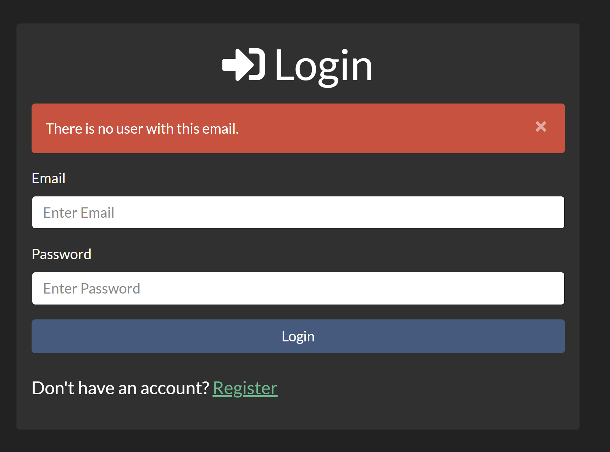
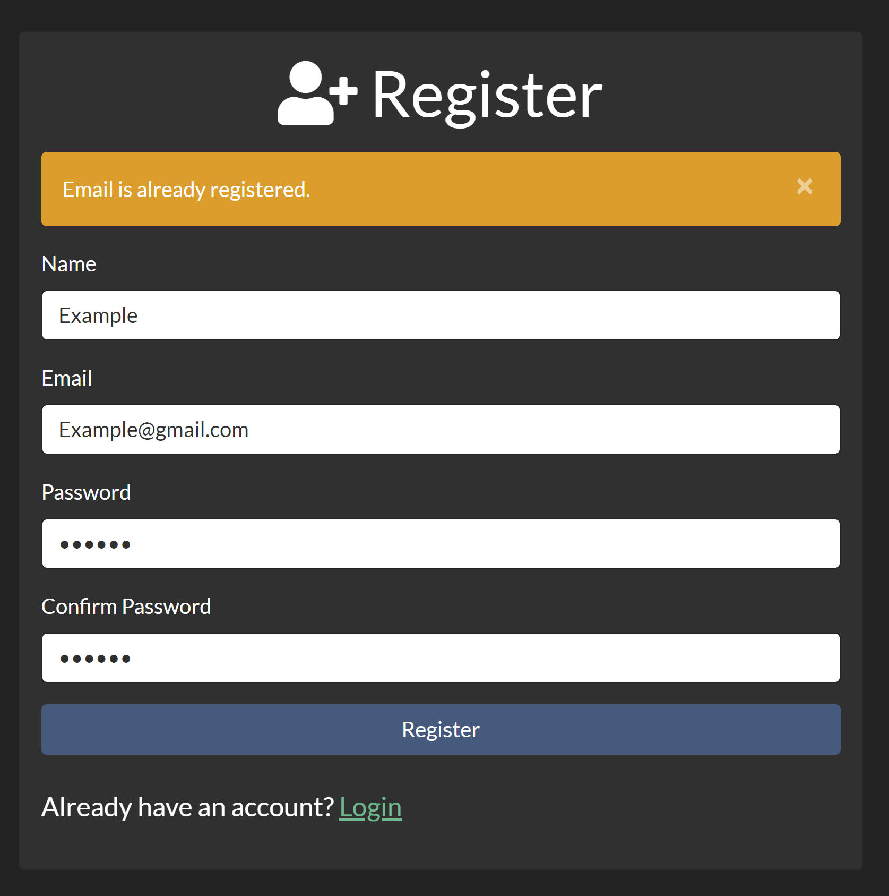
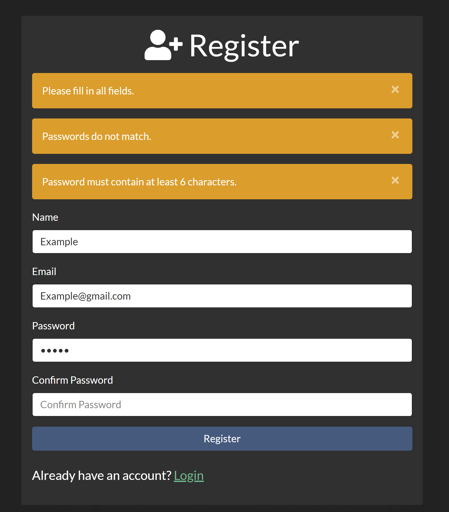
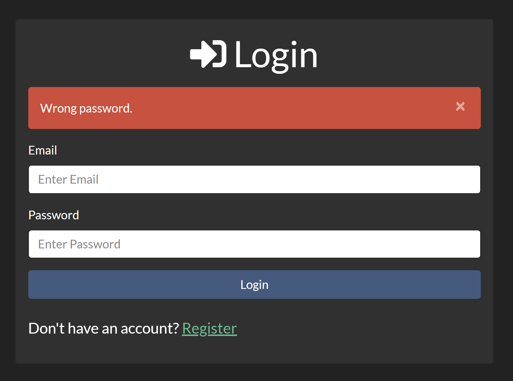
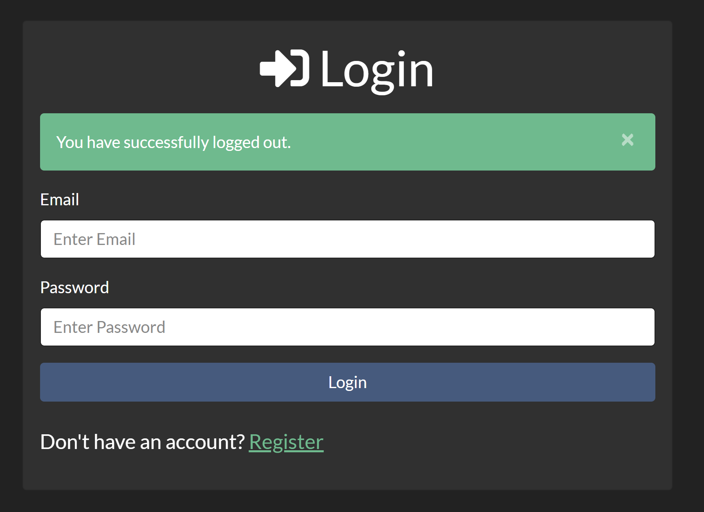
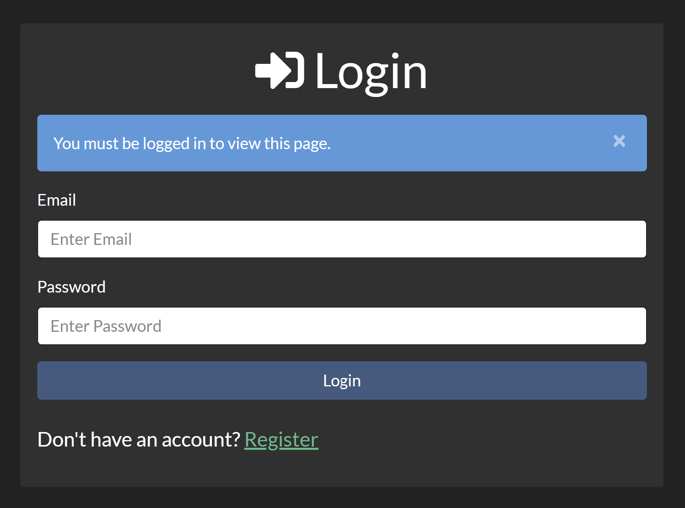

# Authentication
***A simple authentication app where you can experience the authentication process including register/login and if there is an error, an appropriate notification will be displayed.***

## Instructions
##### 1. Clone ***( using `git clone` )*** or Download the folder ***( using ***`Download ZIP`*** option )*** #####
##### 2. Open your code editor and add the project folder #####
##### 3. Open the terminal and install all required dependencies with ***`npm i`*** #####
##### 4. type ***`npm run dev`*** to start the app #####

 ###### 👮 *Enjoy using the app !!* 👮 ######
